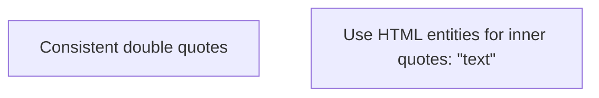
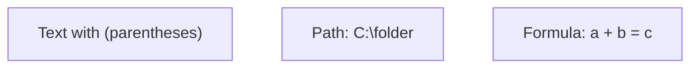
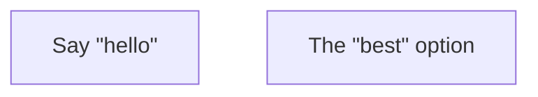
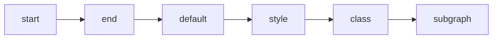
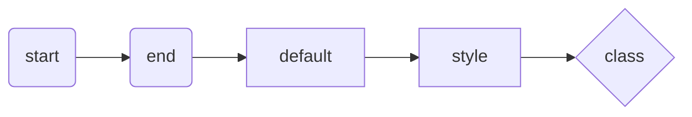
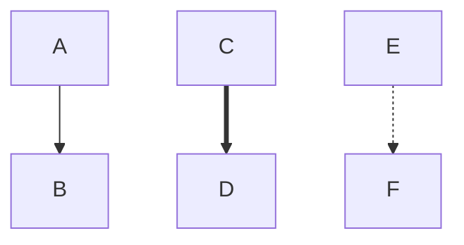
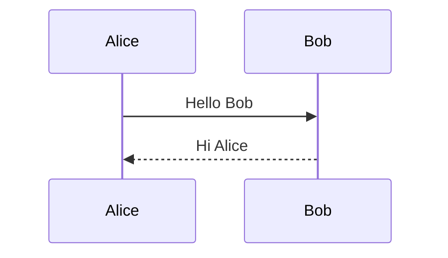
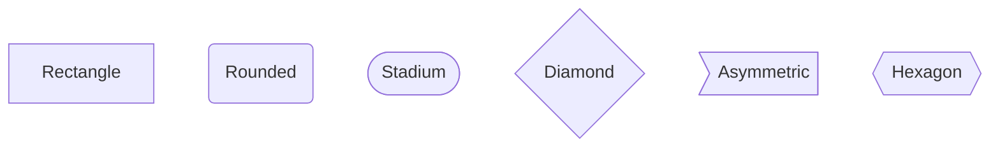
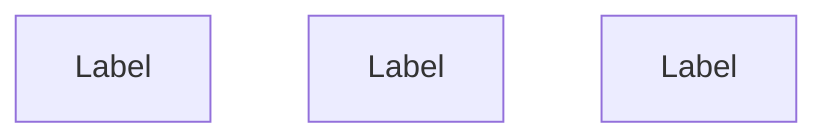
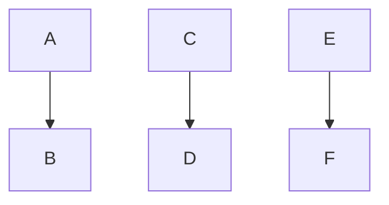

# Common Mistakes That Break Mermaid Diagrams

**Version:** 1.0
**Last Updated:** 2026-02-27
**Purpose:** Comprehensive guide to errors that cause diagram rendering failures

**⚠️ CRITICAL:** This guide documents mistakes that will break your diagrams. Always test diagrams before committing.

---

## Table of Contents

1. [Quote Errors](#quote-errors)
2. [Reserved Word Errors](#reserved-word-errors)
3. [Syntax Errors](#syntax-errors)
4. [Whitespace and Formatting](#whitespace-and-formatting)
5. [ID and Label Errors](#id-and-label-errors)
6. [Arrow and Link Errors](#arrow-and-link-errors)
7. [Subgraph Errors](#subgraph-errors)
8. [Special Character Errors](#special-character-errors)
9. [Quick Reference Checklist](#quick-reference-checklist)

---

## Quote Errors

### ❌ NEVER: Mix Quote Types

**WRONG:**
<!-- validate:skip -->
```mermaid
flowchart TD
    A["Mixed 'quotes"]
    B['Single "double' mix]
```

**ERROR:** Parse failure, unexpected token

**CORRECT:**



### ❌ NEVER: Unquoted Special Characters

**WRONG:**
<!-- validate:skip -->
```mermaid
flowchart TD
    A[Text with (parentheses)]
    B[Path: C:\folder]
    C[Formula: a + b = c]
```

**ERROR:** Parentheses break node syntax

**CORRECT:**



### ❌ NEVER: Unescaped Quotes in Labels

**WRONG:**
<!-- validate:skip -->
```mermaid
flowchart TD
    A[Say "hello"]
    B[The "best" option]
```

**ERROR:** Parser interprets quotes as string delimiters

**CORRECT - Method 1 (HTML Entity):**



**CORRECT - Method 2 (Mermaid Numeric Code):**


---

## Reserved Word Errors

### ❌ NEVER: Use Reserved Keywords Unquoted

**WRONG:**
<!-- validate:skip -->
```mermaid
flowchart TD
    start --> end
    default --> style
    class --> subgraph
```

**ERROR:** `Parse error on line X: got 'END'`

**CORRECT:**



### Critical Reserved Words (MUST Quote)

| Word | Why Reserved | Correct Usage |
| --- | --- | --- |
| `end` | Block terminator | `"end"` or `(end)` or `[end]` |
| `default` | Styling keyword | `"default"` |
| `style` | Styling command | `"style"` |
| `class` | Class assignment | `"class"` |
| `classDef` | Class definition | `"classDef"` |
| `subgraph` | Subgraph keyword | `"subgraph"` |
| `click` | Click handler | `"click"` |
| `call` | Function call | `"call"` |
| `graph` | Graph declaration | `"graph"` |

### Alternative: Use Parentheses/Brackets



**Note:** Using shape syntax `()`, `[]`, `{}` around reserved words also works as they become part of the node definition, not standalone keywords.

---

## Syntax Errors

### ❌ NEVER: Wrong Arrow Syntax

**WRONG:**
<!-- validate:skip -->
```mermaid
flowchart TD
    A -> B       -- Single dash
    C ---> D     -- Triple dash
    E <--> F     -- Bidirectional (not supported in flowchart)
```

**ERROR:** Parse failure, invalid arrow

**CORRECT:**



**Valid Arrow Types:**

- `-->` : Standard arrow (double dash)
- `==>` : Thick arrow
- `-.->` : Dotted arrow

**Valid Arrow Types:**

- `-->` : Standard arrow
- `==>` : Thick arrow
- `-.->` : Dotted arrow
- `x--x` : Cross link
- `o--o` : Circle link

### ❌ NEVER: Missing Colons in Sequence Diagrams

**WRONG:**
<!-- validate:skip -->
```mermaid
sequenceDiagram
    Alice->>Bob Hello Bob
    Bob-->>Alice Hi Alice
```

**ERROR:** Parser expects colon before message text

**CORRECT:**



### ❌ NEVER: Invalid Node Shapes

**WRONG:**
<!-- validate:skip -->
```mermaid
flowchart TD
    A<Node>       -- Invalid syntax
    B<<Node>>     -- Not a valid shape
    C[[Node]]     -- Double brackets (use single)
```

**CORRECT:**



---

## Whitespace and Formatting

### ❌ NEVER: Extra Spaces in IDs

**WRONG:**
<!-- validate:skip -->
```mermaid
flowchart TD
    Node A[Label]      -- Space in ID
    Node-B [Label]     -- Space before bracket
```

**ERROR:** Parser treats as separate tokens

**CORRECT:**



**Valid ID Characters:**

- Letters: `a-z`, `A-Z`
- Numbers: `0-9`
- Underscore: `_`
- Hyphen: `-`
- Dot: `.` (use cautiously)

### ❌ NEVER: Spaces Around Arrows

**WRONG:**
<!-- validate:skip -->
```mermaid
flowchart TD
    A -- > B     -- Space in arrow
    C - -> D     -- Space in arrow
    E-- >F       -- No space after arrow
```

**CORRECT:**



---

## ID and Label Errors

### ❌ NEVER: Use Special Chars in IDs

**WRONG:**
<!-- validate:skip -->
```mermaid
flowchart TD
    Node@1[Label]
    Node#2[Label]
    Node%3[Label]
```

**CORRECT:**

```mermaid
flowchart TD
    Node_1[Label]
    Node_2[Label]
    Node_3[Label]
```

---

## Arrow and Link Errors

### ❌ NEVER: Invalid Link Text Syntax

**WRONG:**
<!-- validate:skip -->
```mermaid
flowchart TD
    A -->Text--> B         -- No pipes
    C -->|Text| D          -- Missing second arrow part
```

**CORRECT:**

```mermaid
flowchart TD
    A -->|Text| B
    C -.->|Optional| D
    E ==>|Emphasized| F
```

### ❌ NEVER: Multiple Arrow Types on One Link

**WRONG:**
<!-- validate:skip -->
```mermaid
flowchart TD
    A -->-.-> B    -- Mixed arrow types
    C ==>--> D     -- Mixed arrow types
```

**CORRECT:**

```mermaid
flowchart TD
    A --> B
    C ==> D
    E -.-> F
```

**Note:** Use one arrow type per link. Don't mix styles on the same connection.

---

## Subgraph Errors

### ❌ NEVER: Forget `end` Keyword

**WRONG:**
<!-- validate:skip -->
```mermaid
flowchart TD
    subgraph Sub1
        A --> B
    subgraph Sub2       -- Missing 'end'
        C --> D
    end
```

**ERROR:** Parser expects `end` to close subgraph

**CORRECT:**

```mermaid
flowchart TD
    subgraph Sub1
        A --> B
    end
    subgraph Sub2
        C --> D
    end
```

### ❌ NEVER: Use Reserved Words as Subgraph IDs

**WRONG:**
<!-- validate:skip -->
```mermaid
flowchart TD
    subgraph end
        A --> B
    end
```

**CORRECT:**

```mermaid
flowchart TD
    subgraph "end"
        A --> B
    end
```

Or use title syntax:

```mermaid
flowchart TD
    subgraph MySubgraph["End Process"]
        A --> B
    end
```

---

## Special Character Errors

### Mermaid Character Codes Reference

**✅ What WORKS in Mermaid:**

| Character | Working Code | Alternative |
| --- | --- | --- |
| `"` | `#34;` | `&quot;` (only `&` entity that works) |
| `(` | `#40;` | N/A |
| `)` | `#41;` | N/A |
| `♥` | `#9829;` | N/A |
| `∞` | `#infin;` | N/A |

**❌ What DOES NOT WORK (displays literally):**

- `&#34;`, `&#40;`, `&#41;` - HTML numeric entities with `&` prefix
- `&lt;`, `&gt;`, `&amp;`, `&apos;`, `&nbsp;` - HTML named entities (except `&quot;`)

**Best Practice:** Use Mermaid codes with `#` prefix (e.g., `#34;`) for consistent behavior.

---

## Quick Reference Checklist

Before committing a diagram, verify:

### Text and Labels

- [ ] All labels with special chars are quoted
- [ ] Line breaks use `<br/>`, not `\n`
- [ ] No unescaped quotes in text
- [ ] Reserved words are quoted
- [ ] Backslashes are escaped (`\\`)

### Syntax

- [ ] Arrows use `-->` (double dash)
- [ ] Sequence messages have colons (`:`)
- [ ] All subgraphs have closing `end`
- [ ] Node IDs start with letters
- [ ] No duplicate IDs

### Formatting

- [ ] Consistent indentation (2 or 4 spaces)
- [ ] No tabs mixed with spaces
- [ ] No spaces in arrows (`-->` not `-- >`)
- [ ] No extra spaces around `<br/>`

### Validation

- [ ] Test with `mermaid.parse()` or `node "$PLUGIN_DIR/scripts/extract_mermaid.js" --validate`
- [ ] Render in Mermaid Live Editor
- [ ] Check for parse errors in console

---

## Debugging Workflow

When a diagram breaks:

1. **Check for Reserved Words**
   - Search for: `end`, `default`, `style`, `class`, `subgraph`
   - Wrap in quotes: `"end"`, `"default"`, etc.

2. **Check Line Breaks**
   - Replace `\n` with `<br/>`
   - Remove spaces around `<br/>`

3. **Check Quotes**
   - Ensure all special chars are inside quotes
   - Escape quotes: `#34;` or `&quot;`

4. **Check Arrows**
   - Use `-->` not `->` or `--->`
   - Check for typos in arrow syntax

5. **Validate Programmatically**

   ```bash
   node "$PLUGIN_DIR/scripts/extract_mermaid.js" diagram.md --validate
   ```

6. **Check Console Errors**
   - Look for line numbers in error messages
   - Common: "Parse error on line X"
   - Common: "Unexpected token"

---

## Summary

**Most Common Mistakes:**

1. ❌ Using reserved words without quotes (`end`, `default`, `style`)
2. ❌ Unquoted parentheses in labels `()`
3. ❌ Wrong arrow syntax (`->` instead of `-->`)
4. ❌ Missing colons in sequence diagrams
5. ❌ Missing `end` keywords in subgraphs
6. ❌ Spaces in node IDs

**Golden Rules:**

- ✅ When in doubt, quote it
- ✅ Always close subgraphs with `end`
- ✅ Use `-->` for arrows (double dash)
- ✅ Test early, test often
- ✅ Use validation scripts before committing

**Related Guides:**

- [Troubleshooting Guide](troubleshooting.md) - Detailed error solutions
- [Styling Guide](styling-guide.md) - Correct styling syntax
- [Resilient Workflow](resilient-workflow.md) - Validation workflow

---

**Version:** 1.0
**Last Updated:** 2026-02-27
