# Mermaid Diagram Styling Guide

**Version:** 1.0
**Last Updated:** 2026-02-27
**Purpose:** Comprehensive guide to styling Mermaid diagrams with colors, classes, and themes

---

## Table of Contents

1. [Overview](#overview)
2. [Testing Styles](#testing-styles)
3. [Mermaid Built-in Themes](#mermaid-built-in-themes)
4. [ClassDef - Optional Override Approach](#classdef---optional-override-approach)
5. [Inline Styling](#inline-styling)
6. [Color Schemes](#color-schemes)
7. [High-Contrast Accessibility](#high-contrast-accessibility)
8. [Node-Specific Styling](#node-specific-styling)
9. [Link/Arrow Styling](#linkarrow-styling)
10. [Subgraph Styling](#subgraph-styling)
11. [Best Practices](#best-practices)
12. [Complete Examples](#complete-examples)

---

## Overview

Mermaid diagrams support two primary styling methods:

| Method | Use Case | Advantages | Disadvantages |
| --- | --- | --- | --- |
| **Theme / themeVariables** | Global visual style across the whole diagram | Consistent, user-configured, low maintenance | Less granular per-node control |
| **ClassDef** | Targeted overrides for specific nodes | Fine-grained control when needed | Can override user theme and create visual drift |
| **Inline** | One-off styling for specific nodes | Quick, simple for single nodes | Repetitive, harder to maintain |

**Recommendation:** Use theme-first styling for production diagrams. Use `classDef` only for explicit, minimal overrides.

---

## Testing Styles

Always validate your styled diagrams before committing to ensure rendering works correctly.

### Validation Methods

**Method 1: Node.js Script Validation**

```bash
# Extract and validate all diagrams in a file
node "$PLUGIN_DIR/scripts/extract_mermaid.js" styling-guide.md --validate

# Validate specific diagram
node "$PLUGIN_DIR/scripts/extract_mermaid.js" my-diagram.mmd --validate
```

**Method 2: Mermaid Live Editor**

1. Visit: <https://mermaid.live>
2. Paste your diagram code
3. Check for syntax errors in console
4. Verify colors render correctly
5. Test on light/dark backgrounds

**Method 3: Browser Console Testing**

```javascript
// Test diagram syntax in browser console
mermaid.parse(`
flowchart TD
    A[Test]:::myClass
    classDef myClass fill:#f00
`);
// Returns true if valid, throws error if invalid
```

### Common Validation Checks

Before committing styled diagrams:

- [ ] If `classDef` is used, each definition is necessary and applied
- [ ] All class references exist
- [ ] Any explicit color overrides are intentional and minimal
- [ ] Text contrast meets WCAG AA (4.5:1 minimum)
- [ ] Diagram renders without errors
- [ ] Colors are distinguishable on light/dark modes

---

## Mermaid Built-in Themes

Mermaid provides built-in themes that automatically style diagrams without custom `classDef` definitions.

### Available Themes

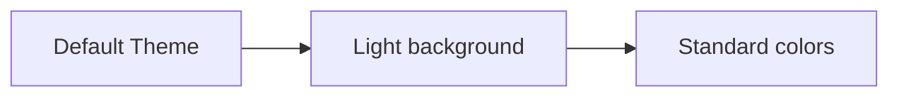

**Theme Options:**

| Theme | Description | Use Case |
| --- | --- | --- |
| `default` | Standard light theme with blue accents | General purpose, documentation |
| `dark` | Dark background with light text | Dark mode UI, presentations |
| `forest` | Green tones with natural colors | Environmental, organic processes |
| `neutral` | Grayscale palette | Professional, minimal distraction |
| `base` | Minimal styling, clean look | When you want control, starting point |

### Using Themes

**Syntax:**

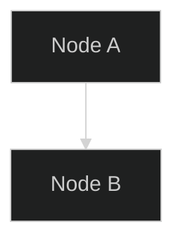

**Multiple Theme Options:**

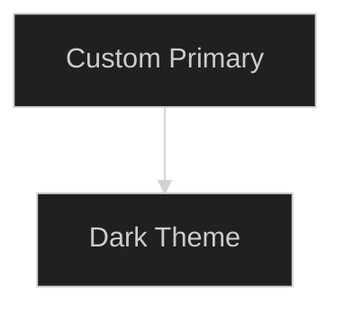

### Theme vs Custom Styling

**When to use themes:**

- ✅ Quick prototypes without custom colors
- ✅ Consistent look across multiple diagrams
- ✅ Dark mode requirements
- ✅ Minimal configuration needed

**When to use custom `classDef`:**

- ✅ Specific brand colors required
- ✅ Semantic color coding (red=error, green=success)
- ✅ User explicitly asked for custom node-level styling
- ✅ Fine-grained control over styling

**Combining themes with custom styles:**

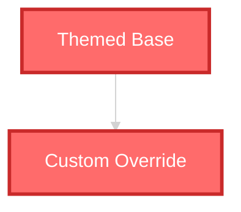

**Note:** Custom `classDef` definitions override theme defaults for specific nodes.

---

## ClassDef - Optional Override Approach

### Basic Syntax

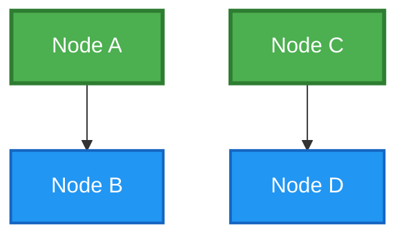

### Properties Reference

```css
classDef className fill:#color,stroke:#color,stroke-width:2px,color:#color,stroke-dasharray:5 5
```

**Available Properties:**

- `fill` - Background color
- `stroke` - Border color
- `stroke-width` - Border thickness (in px)
- `stroke-dasharray` - Dashed border pattern (e.g., `5 5` for dashes)
- `color` - Text color
- `font-size` - Text size (e.g., `14px`, `16px`)
- `font-weight` - Text weight (bold, normal, 600)
- `font-family` - Font typeface (Arial, monospace, etc.)

### Font Styling Example


**Font Property Tips:**

- **font-size:** Use `px` units (e.g., `14px`, `18px`). Avoid relative units.
- **font-weight:** Use keywords (`bold`, `normal`) or numeric values (`400`, `600`, `700`).
- **font-family:** Prefer web-safe fonts (`Arial`, `monospace`, `sans-serif`).
- **Readability:** Larger fonts (16px+) reduce strain, smaller fonts (11px-) for secondary info.

### Multiple Class Assignment

**Method 1: Separate class statement**

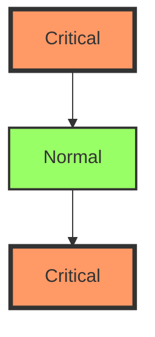

**Method 2: Inline class assignment (:::syntax)**


### Default Class Override

Override the default node style:

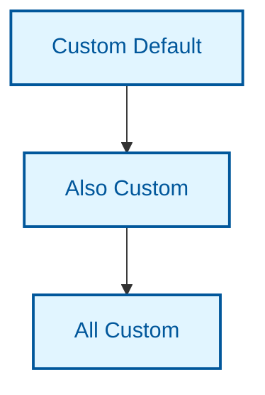

---

## Inline Styling

### Basic Inline Style

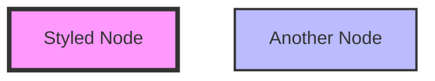

### Multiple Properties


### When to Use Inline Styling

✅ **Good use cases:**

- Quick prototypes
- One-off special nodes
- Testing color combinations

❌ **Avoid for:**

- Multiple nodes with same style
- Production diagrams
- Repeated patterns

---

## Color Schemes

### High-Contrast Color Palette (Recommended)

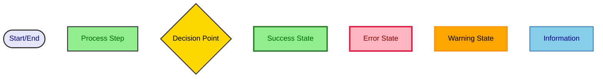

### Color Palette Reference

**Process/Success Colors (Green Family):**

- `#90EE90` - Light green (process background)
- `#2E7D2E` - Dark green (success border)
- `#006400` - Dark green (text)

**Decision/Warning Colors (Yellow/Orange Family):**

- `#FFD700` - Gold (decision background)
- `#FFA500` - Orange (warning background)
- `#FF8C00` - Dark orange (border)

**Error Colors (Red/Pink Family):**

- `#FFB6C1` - Light pink (error background)
- `#DC143C` - Crimson (error border)
- `#8B0000` - Dark red (text)

**Information Colors (Blue Family):**

- `#E6E6FA` - Lavender (start/end background)
- `#87CEEB` - Sky blue (info background)
- `#4682B4` - Steel blue (border)
- `#00008B` - Dark blue (text)

### Web-Safe Color Alternatives


---

## High-Contrast Accessibility

### WCAG AA Compliant Colors

Ensure text contrast ratio ≥ 4.5:1 for normal text:

**Mandatory requirements:**

- Always include `color:` in every `classDef`
- Always include `color:` in every inline `style` statement
- Do not rely on theme defaults for text color

**Quick check (find missing `color:`):**

```bash
rg "classDef" yourfile.md | rg -v "color:"
rg "style" yourfile.md | rg -v "color:"
```


### Testing Contrast

**Testing Tools:**

**1. WebAIM Contrast Checker**

- URL: <https://webaim.org/resources/contrastchecker/>
- Input foreground and background hex colors (e.g., `#1976D2`, `#FFFFFF`)
- Shows contrast ratio and AA/AAA compliance levels
- Provides pass/fail for normal and large text
- Suggests alternative colors that pass

**2. Chrome DevTools**

- Right-click element → Inspect
- Click color swatch in Styles panel
- Color picker shows contrast ratio with background
- Red warning icon indicates non-compliant colors
- Suggested colors section shows accessible alternatives

**3. Online Palette Checkers**

- **Coolors.co Contrast Checker:** <https://coolors.co/contrast-checker>
  - Test entire color palettes at once
  - Export accessible color combinations
- **Adobe Color Accessibility Tools:** <https://color.adobe.com/create/color-accessibility>
  - Check color blindness compatibility
  - Simulate different vision types (protanopia, deuteranopia, tritanopia)
- **Colour Contrast Checker:** <https://colourcontrast.cc/>
  - Simple, fast contrast validation
  - No registration required

**Minimum Ratios:**

- Normal text (< 18pt): 4.5:1 (AA), 7:1 (AAA)
- Large text (≥ 18pt or 14pt bold): 3:1 (AA), 4.5:1 (AAA)
- Graphical objects and UI components: 3:1 (AA)

**Quick Reference:**

| Foreground | Background | Ratio | AA Pass? |
| --- | --- | --- | --- |
| `#FFFFFF` | `#1976D2` | 5.37:1 | ✅ Yes |
| `#000000` | `#FFD700` | 10.4:1 | ✅ Yes |
| `#FFEB3B` | `#FFFFFF` | 1.47:1 | ❌ No |
| `#006400` | `#90EE90` | 4.98:1 | ✅ Yes |

---

## Node-Specific Styling

### Different Shapes, Different Styles

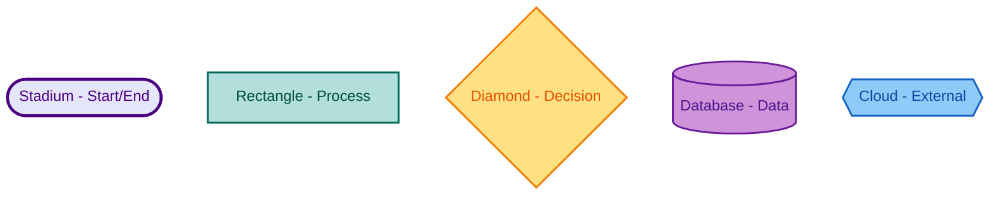

---

## Link/Arrow Styling

### Link Style Syntax

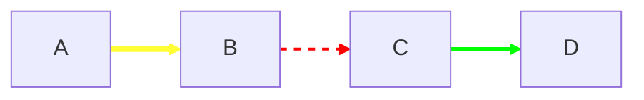

**Properties:**

- `stroke` - Line color
- `stroke-width` - Line thickness
- `stroke-dasharray` - Dash pattern

**Important:** Link indices are **zero-based**. The first link is `0`, second is `1`, etc.

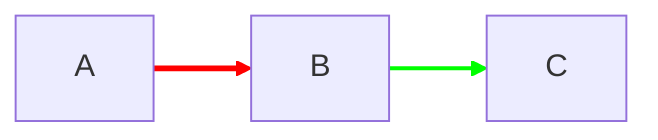

**Counting Links:**

- Links are numbered in the order they appear in the diagram code
- Conditional links (Yes/No branches) count as separate links
- Each arrow creates one link entry

### Emphasizing Critical Paths

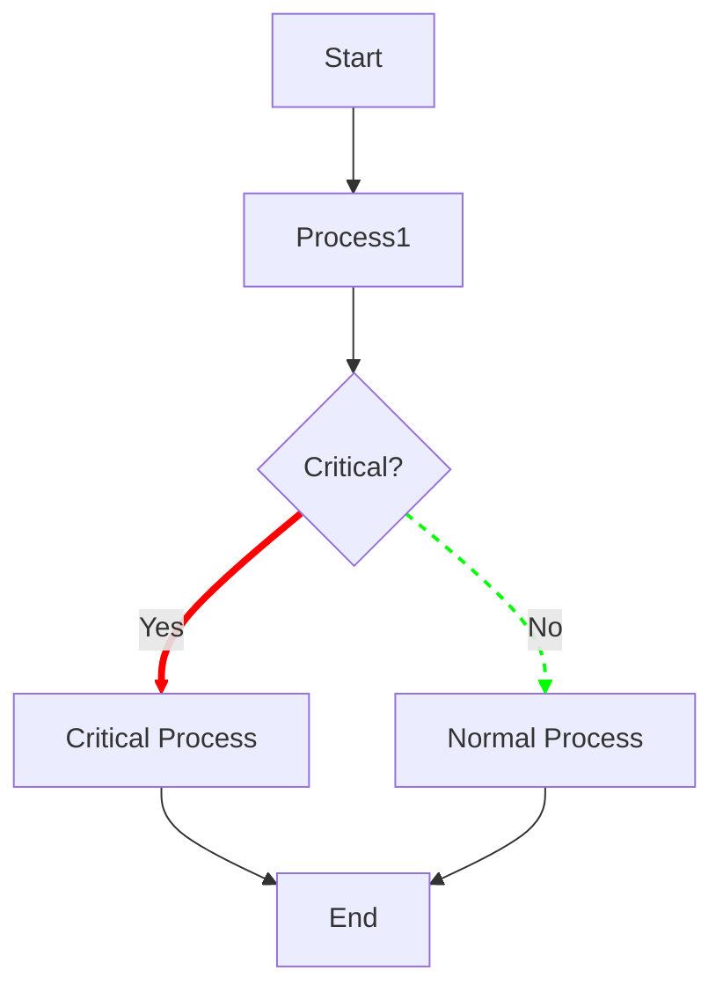

---

## Subgraph Styling

### Basic Subgraph Style

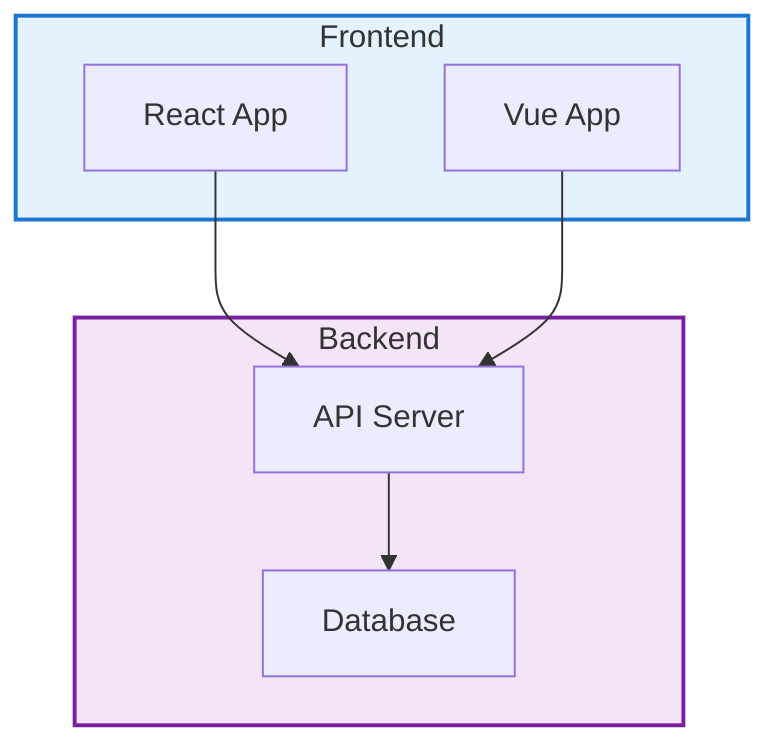

### Nested Subgraphs

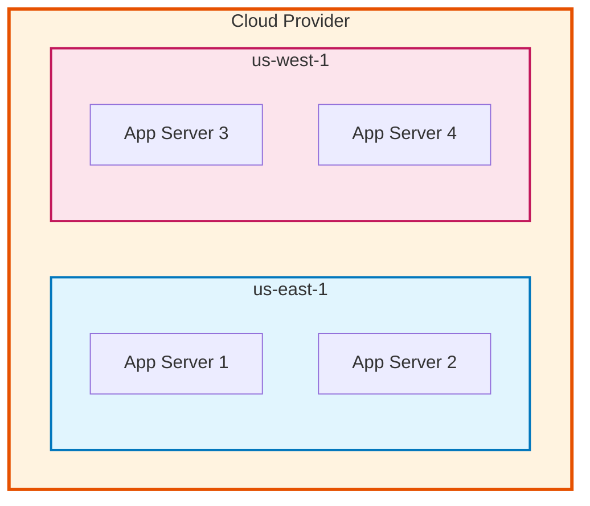

---

## Best Practices

### 1. Consistency is Key

✅ **Do:**

```mermaid
flowchart TD
    A[Process 1]:::process --> B[Process 2]:::process --> C[Process 3]:::process

    classDef process fill:#90EE90,stroke:#333,stroke-width:2px,color:darkgreen
```

❌ **Don't:**

```mermaid
flowchart TD
    A[Process 1]
    B[Process 2]
    C[Process 3]

    style A fill:#90EE90,stroke:#333,stroke-width:2px
    style B fill:#88DD88,stroke:#222,stroke-width:3px
    style C fill:#80CC80,stroke:#444,stroke-width:1px
```

### 2. Semantic Colors

Use colors that convey meaning:

- 🟢 Green: Success, completion, valid
- 🔴 Red: Error, failure, invalid
- 🟡 Yellow: Warning, decision, caution
- 🔵 Blue: Information, process, neutral
- ⚪ Gray: Disabled, inactive, secondary

### 3. Limit Color Palette

**Recommended:** 4-6 colors maximum per diagram

✅ **Good:**

```mermaid
flowchart TD
    A[Start]:::primary
    B[Process]:::secondary
    C{Decision}:::accent
    D[End]:::primary

    classDef primary fill:#1976D2,stroke:#0D47A1,stroke-width:2px,color:white
    classDef secondary fill:#4CAF50,stroke:#2E7D32,stroke-width:2px,color:white
    classDef accent fill:#FFC107,stroke:#F57C00,stroke-width:2px,color:#000
```

❌ **Too many colors:**

```text
- 12 different fill colors
- 8 different stroke colors
- 5 different text colors
= Visual chaos
```

### 4. Text Contrast

**Always ensure readable text:**

✅ **Good:**

- White text on dark backgrounds (#1976D2, #4CAF50, #F44336)
- Dark text on light backgrounds (#E3F2FD, #F1F8E9, #FFEBEE)

❌ **Bad:**

- Yellow text on white background (contrast ratio < 1.5)
- Light gray text on white background

### 5. Stroke Width Hierarchy

Use stroke width to show importance:

```mermaid
flowchart TD
    Critical[Critical Path]:::critical
    Important[Important]:::important
    Normal[Normal]:::normal

    classDef critical stroke-width:4px,stroke:#f00
    classDef important stroke-width:3px,stroke:#ff0
    classDef normal stroke-width:2px,stroke:#0f0
```

---

## Complete Examples

### Example 1: Business Process Diagram

```mermaid
flowchart TD
    Start([New Order Received]):::start
    Validate[Validate Order Details]:::process
    CheckStock{Items<br/>In Stock?}:::decision
    Reserve[Reserve Inventory]:::process
    Payment[Process Payment]:::process
    PaymentOK{Payment<br/>Successful?}:::decision
    Ship[Ship Order]:::process
    Complete([Order Complete]):::success
    OutOfStock[Notify Out of Stock]:::error
    PaymentFailed[Payment Failed]:::error
    Refund[Refund & Cancel]:::process

    Start --> Validate
    Validate --> CheckStock
    CheckStock -->|Yes| Reserve
    CheckStock -->|No| OutOfStock
    Reserve --> Payment
    Payment --> PaymentOK
    PaymentOK -->|Yes| Ship
    PaymentOK -->|No| PaymentFailed
    Ship --> Complete
    PaymentFailed --> Refund
    Refund --> OutOfStock

    classDef start fill:#E6E6FA,stroke:#4B0082,stroke-width:2px,color:#4B0082
    classDef process fill:#90EE90,stroke:#2E7D2E,stroke-width:2px,color:#006400
    classDef decision fill:#FFD700,stroke:#DAA520,stroke-width:2px,color:#000
    classDef success fill:#90EE90,stroke:#2E7D2E,stroke-width:3px,color:#006400
    classDef error fill:#FFB6C1,stroke:#DC143C,stroke-width:3px,color:#8B0000
```

### Example 2: Architecture Diagram with Subgraphs

```mermaid
flowchart TB
    subgraph Client["Client Layer"]
        Web[🌐 Web App]:::client
        Mobile[📱 Mobile App]:::client
    end

    subgraph API["API Layer"]
        Gateway[🚪 API Gateway]:::api
        Auth[🔐 Auth Service]:::api
    end

    subgraph Services["Business Services"]
        UserSvc[👤 User Service]:::service
        OrderSvc[📦 Order Service]:::service
        PaymentSvc[💳 Payment Service]:::service
    end

    subgraph Data["Data Layer"]
        UserDB[(👥 User DB)]:::database
        OrderDB[(📋 Order DB)]:::database
        Cache[(⚡ Redis)]:::cache
    end

    Web --> Gateway
    Mobile --> Gateway
    Gateway --> Auth
    Auth --> UserSvc
    Gateway --> UserSvc
    Gateway --> OrderSvc
    Gateway --> PaymentSvc
    UserSvc --> UserDB
    OrderSvc --> OrderDB
    PaymentSvc --> Cache
    UserSvc --> Cache

    classDef client fill:#E3F2FD,stroke:#1976D2,stroke-width:2px,color:#0D47A1
    classDef api fill:#FFF3E0,stroke:#F57C00,stroke-width:2px,color:#E65100
    classDef service fill:#E8F5E9,stroke:#388E3C,stroke-width:2px,color:#1B5E20
    classDef database fill:#F3E5F5,stroke:#7B1FA2,stroke-width:2px,color:#4A148C
    classDef cache fill:#FFEBEE,stroke:#D32F2F,stroke-width:2px,color:#B71C1C

    style Client fill:#e3f2fd,stroke:#1976d2,stroke-width:2px
    style API fill:#fff3e0,stroke:#f57c00,stroke-width:2px
    style Services fill:#e8f5e9,stroke:#388e3c,stroke-width:2px
    style Data fill:#f3e5f5,stroke:#7b1fa2,stroke-width:2px
```

### Example 3: Sequence Diagram with Styling

```mermaid
sequenceDiagram
    autonumber
    participant C as 👤 Client
    participant G as 🌐 Gateway
    participant A as 🔐 Auth
    participant S as ⚙️ Service
    participant D as 💾 Database

    rect #E6F4FF
        Note over C,A: Authentication Phase
        C->>+G: POST /login
        G->>+A: Validate Token
        A->>A: Check Credentials
        A-->>-G: Valid ✅
        G-->>-C: 200 OK + JWT
    end

    rect #E8F5E9
        Note over C,D: Data Request Phase
        C->>+G: GET /data
        G->>+S: Fetch Data
        S->>+D: Query
        D-->>-S: Results
        S->>S: Process
        S-->>-G: Formatted Data
        G-->>-C: 200 OK
    end
```

---

## Summary

**Key Takeaways:**

1. ✅ Use `classDef` for consistent, maintainable styling
2. 🎨 Stick to 4-6 colors maximum per diagram
3. ♿ Ensure WCAG AA contrast ratios (4.5:1 minimum)
4. 🎯 Use semantic colors (green=success, red=error, etc.)
5. 📏 Use stroke-width to show hierarchy
6. 🔄 Reuse class definitions across diagrams for consistency

**Related Guides:**

- [Troubleshooting Guide](troubleshooting.md) - Common styling errors
- [Common Mistakes](common-mistakes.md) - Styling pitfalls to avoid
- [Activity Diagrams](diagrams/activity-diagrams.md) - Workflow styling examples
- [Sequence Diagrams](diagrams/sequence-diagrams.md) - Interaction styling examples

---

**Version:** 1.1
**Last Updated:** 2026-02-27
