# Mermaid Syntax Troubleshooting Guide

**Version:** 1.0
**Last Updated:** 2026-02-27
**Purpose:** Common syntax errors and how to fix them

This guide documents the top 20+ most common Mermaid syntax errors discovered through research of GitHub issues, Stack Overflow questions, and community forums.

---

## Table of Contents

1. [Quick Validation](#quick-validation)
2. [Cross-Cutting Issues (All Diagrams)](#cross-cutting-issues-all-diagrams)
3. [Flowchart & Graph Diagrams](#flowchart--graph-diagrams)
4. [Sequence Diagrams](#sequence-diagrams)
5. [Class Diagrams](#class-diagrams)
6. [State Diagrams](#state-diagrams)
7. [ER Diagrams](#er-diagrams)
8. [Gantt Charts](#gantt-charts)
9. [Pie Charts](#pie-charts)
10. [General Resources](#general-resources)

---

## Quick Validation

**Before debugging syntax manually, use the validation scripts:**

```bash
# Validate all diagrams in a markdown file
node "$PLUGIN_DIR/scripts/extract_mermaid.js" your-file.md --validate

# Convert to image to verify rendering
node "$PLUGIN_DIR/scripts/render.js" diagram.mmd --output output.svg
```

**Common Quick Fixes:**

- ✅ Wrap reserved words in double quotes
- ✅ Check for missing closing `end` keywords in blocks
- ✅ Ensure colons exist before message text in sequence diagrams
- ✅ Verify arrow syntax (must be `-->`, not `->`)
- ✅ Escape special characters with quotes or HTML entities

### Programmatic Validation (Mermaid.js)

**Official Mermaid.parse() Method:**

```javascript
import mermaid from 'mermaid';

mermaid.initialize({ startOnLoad: false });

// Validate diagram syntax
const diagramText = `
flowchart LR
    A[Hard] -->|Text| B(Round)
    B --> C{Decision}
    C -->|One| D[Result 1]
`;

try {
  const result = await mermaid.parse(diagramText);
  console.log('✅ Valid diagram type:', result.diagramType);
  // Output: { diagramType: 'flowchart-v2' }
} catch (error) {
  console.error('❌ Parse error:', error.message);
  // Handle syntax errors
}
```

**With Error Suppression:**

```javascript
// Returns false instead of throwing on error
const result = await mermaid.parse(invalidDiagram, { suppressErrors: true });
if (result === false) {
  console.log('Invalid diagram syntax');
}
```

**Custom Error Handler:**

```javascript
mermaid.parseError = (err, hash) => {
  console.error('Custom error:', err);
  // Display to user, log, etc.
};
```

---

## Cross-Cutting Issues (All Diagrams)

### ❌ Error 1: Reserved Words as Identifiers

**Severity:** 🔴 Critical - Causes immediate parse failure

**Problem:** Using reserved keywords without quotes breaks the parser.

**Reserved Words Include:**

**Common Keywords (Must Always Quote):**

- `end` - Most critical! Used to close blocks
- `default` - Used in styling
- `style` - Styling command
- `class` - Class assignment
- `classDef` - Class definition
- `click` - Click handler
- `call` - Function calls
- `subgraph` - Subgraph definition
- `graph` - Graph type declaration

**Link Targets:**

- `_self`, `_blank`, `_parent`, `_top`

**Additional Keywords:**

- `interpolate`, `linkStyle`, `flowchart`, `sequenceDiagram`
- `loop`, `alt`, `else`, `opt`, `par`, `and` (in sequence diagrams)

**Branch Names (Git Graph):**

- Words that could be confused with keywords like `cherry-pick` must be quoted

**Incorrect:**
<!-- validate:skip -->
```mermaid
flowchart TD
    start --> end
    call --> style
```

**Correct (using safe IDs with reserved word labels):**

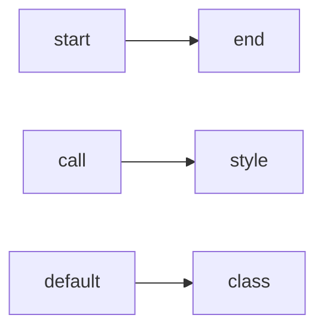

**Also valid (define nodes with shapes containing reserved words):**

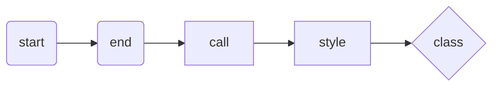

**Sequence Diagram Example:**

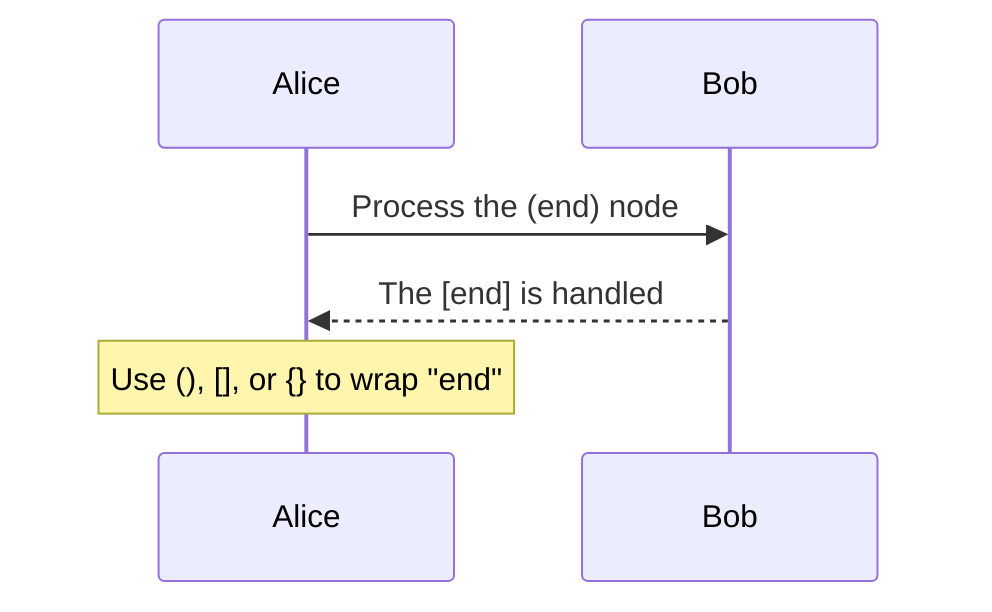

**Error Message:**

- `Parse error on line X: ... got 'DEFAULT'`
- `Syntax error in text`

**Diagram Types Affected:** All diagrams (especially flowcharts, state diagrams, Gantt charts)

---

### ❌ Error 2: Unescaped Special Characters

**Severity:** 🟠 High - Breaks rendering or causes silent failures

**Problem:** Special characters in labels must be escaped or wrapped in quotes.

**Special Characters:**

- Double quotes: `"`
- Parentheses: `(` `)`
- Brackets: `[` `]` `{` `}`
- Backslash: `\`
- Colon: `:`, Semicolon: `;`, Comma: `,`
- Hash: `#`, Percent: `%`, At: `@`

**Incorrect:**
<!-- validate:skip -->
```mermaid
flowchart TD
    A[Say "hello"]
    B[Domain\User1]
    C[Object(foo,bar)]
```

**Correct - Method 1 (Quotes):**

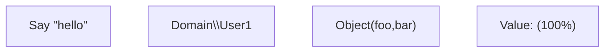

**Correct - Method 2 (HTML Entities):**

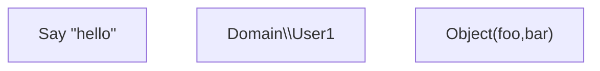

**Correct - Method 3 (Simple Quotes for Basic Cases):**

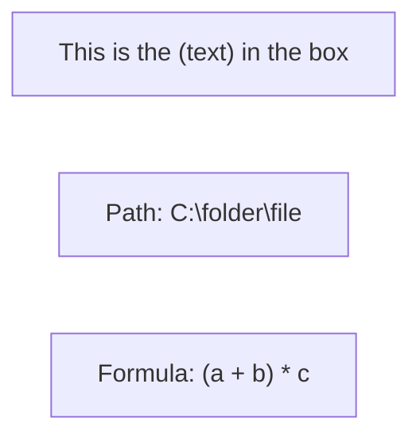

**Sequence Diagrams with Special Chars:**

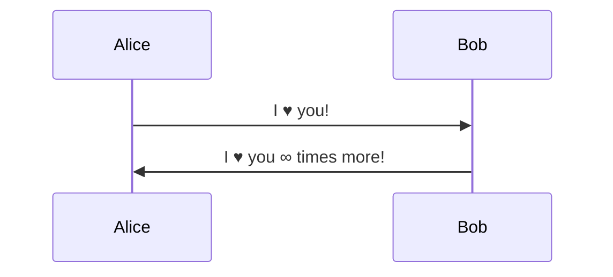

**Common Mermaid Character Codes:**

- `&quot;` or `#34;` for `"` (quotes)
- `#40;` for `(` (left parenthesis)
- `#41;` for `)` (right parenthesis)
- `#9829;` for ♥
- `#infin;` for ∞

**⚠️ Note:** Mermaid uses `#` prefix for character codes. HTML numeric entities with `&` prefix (like `&#34;`, `&#40;`) do NOT work and will display literally. Most HTML named entities (`&gt;`, `&lt;`, `&amp;`) also do NOT work except `&quot;`.

**Diagram Types Affected:** All diagrams

**Best Practice:** When in doubt, wrap the entire label in double quotes.

---

## Flowchart & Graph Diagrams

### ❌ Error 5: Reserved Word "end" in Node Names

**Severity:** 🔴 Critical

**Problem:** The word "end" is reserved and breaks flowcharts.

**Incorrect:**
<!-- validate:skip -->
```mermaid
flowchart TD
    start --> end
```

**Correct Solutions:**

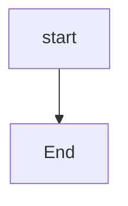

**Or use a different ID with label:**

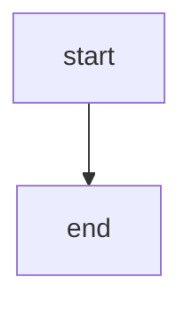

**Error Message:** Parser treats "end" as keyword, not node ID

---

### ❌ Error 7: Incorrect Arrow/Link Syntax

**Severity:** 🔴 Critical - Prevents connections

**Problem:** Missing dashes or using wrong arrow syntax.

**Incorrect:**
<!-- validate:skip -->
```mermaid
flowchart TD
    A - B
    %% Single dash
    C -> D
    %% Two characters instead of three
    E .-> F
    %% Deprecated dotted syntax
```

**Correct:**

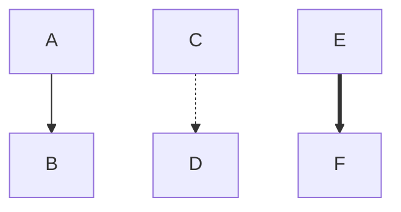

**Valid Arrow Types:**

- `-->` Standard arrow
- `-.->` Dotted arrow
- `==>` Thick arrow
- `---` No arrow (line only)
- `-.-` Dotted line

---

### ❌ Error 8: Incorrect Node Bracket Syntax

**Severity:** 🔴 Critical

**Problem:** Missing or mismatched brackets around node labels.

**Incorrect:**
<!-- validate:skip -->
```mermaid
flowchart TD
    A[Start --> B[Process]]
```

**Correct:**

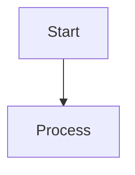

**Node Shape Reference:**

- `[]` Rectangle
- `()` Rounded
- `[[]]` Subroutine
- `[()]` Stadium
- `{}` Diamond
- `{{}}` Hexagon
- `[/\]` Trapezoid
- `[\]` Reverse trapezoid

---

### ❌ Error 9: Diagram Direction on Same Line as Nodes

**Severity:** 🔴 Critical

**Problem:** Diagram type and direction must be on a separate line.

**Incorrect:**
<!-- validate:skip -->
```mermaid
flowchart TD A --> B
```

**Correct:**

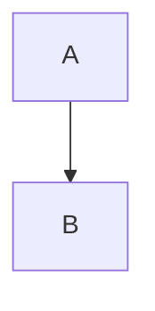

---

## Sequence Diagrams

### ❌ Error 11: Missing Colon Before Message Text

**Severity:** 🔴 Critical

**Problem:** Colon is required to separate arrow from message.

**Incorrect:**
<!-- validate:skip -->
```mermaid
sequenceDiagram
    Alice->>Bob Message
```

**Correct:**

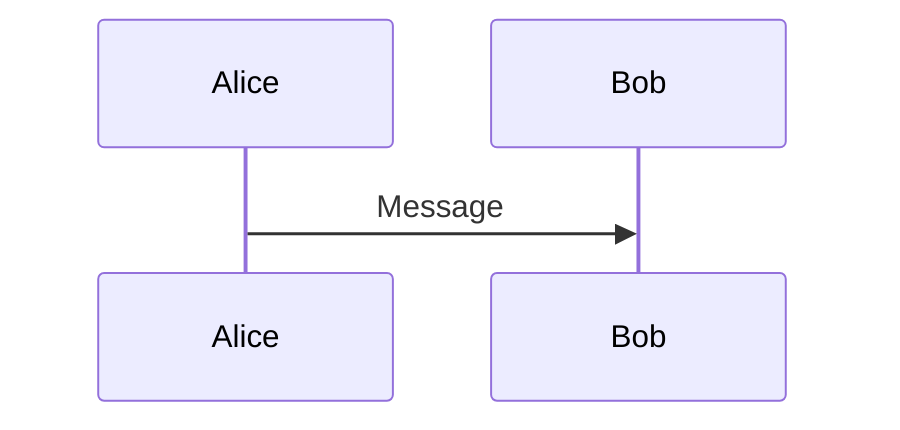

---

### ❌ Error 12: Missing Space in Participant Declaration

**Severity:** 🔴 Critical

**Problem:** No space between "participant" keyword and participant name.

**Incorrect:**
<!-- validate:skip -->
```mermaid
sequenceDiagram
    participantAlice
```

**Correct:**

```mermaid
sequenceDiagram
    participant Alice
```

---

### ❌ Error 13: Missing "end" in alt/opt/loop Blocks

**Severity:** 🔴 Critical - Causes parse errors

**Problem:** Forgetting to close blocks with "end" keyword.

**Incorrect:**
<!-- validate:skip -->
```mermaid
sequenceDiagram
    Alice->>Bob: Request
    alt Success
        Bob->>Alice: OK
    else Failure
        Bob->>Alice: Error
```

**Correct:**

```mermaid
sequenceDiagram
    Alice->>Bob: Request
    alt Success
        Bob->>Alice: OK
    else Failure
        Bob->>Alice: Error
    end
```

**Affected Blocks:** `alt`, `opt`, `loop`, `par`, `rect`, `break`, `critical`

---

## Class Diagrams

## State Diagrams

### ❌ Error 20: Incorrect State Description Syntax

**Severity:** 🔴 Critical

**Problem:** Using colon instead of "as" keyword with state descriptions.

**Incorrect:**
<!-- validate:skip -->
```mermaid
stateDiagram-v2
    state "This is a description": s2
```

**Correct:**

```mermaid
stateDiagram-v2
    state "This is a description" as s2
```

---

### ❌ Error 21: ClassDef on Special States

**Severity:** 🟡 Medium

**Problem:** Classes cannot be applied to `[*]` (start/end states).

**Incorrect:**
<!-- validate:skip -->
```mermaid
stateDiagram-v2
    classDef myClass fill:#f00
    class [*] myClass
```

**Correct:**

```mermaid
stateDiagram-v2
    classDef myClass fill:#f00
    class NormalState myClass
    [*] --> NormalState
```

---

## ER Diagrams

### ❌ Error 22: Wrong Attribute Order

**Severity:** 🔴 Critical

**Problem:** Attribute type must come BEFORE the name.

**Incorrect:**
<!-- validate:skip -->
```mermaid
erDiagram
    Order {
        id int
        amount float
    }
```

**Correct:**

```mermaid
erDiagram
    Order {
        int id
        float amount
    }
```

**Error Message:** `Expected ATTRIBUTE_WORD but found BLOCK_STOP`

---

### ❌ Error 23: Invalid Relationship Syntax

**Severity:** 🔴 Critical

**Problem:** Using incomplete relationship notation.

**Incorrect:**
<!-- validate:skip -->
```mermaid
erDiagram
    Order |-- Customer
```

**Correct:**

```mermaid
erDiagram
    Order }|..|{ Customer
```

**Relationship Notation:**

- First marker: `}|` (many), `||` (one), `o|` (zero or one)
- Relationship line: `--` (identifying), `..` (non-identifying)
- Second marker: `|{` (many), `||` (one), `|o` (zero or one)

---

## Gantt Charts

### ❌ Error 24: Reserved Words as Task Names

**Severity:** 🔴 Critical

**Problem:** Words like "gantt", "section", "dateFormat" cause errors.

**Incorrect:**
<!-- validate:skip -->
```mermaid
gantt
    dateFormat YYYY-MM-DD
    section Section
    gantt : active, 2021-04-03, 1d
    section : 2021-04-04, 1d
```

**Correct:**

```mermaid
gantt
    dateFormat YYYY-MM-DD
    section Section
    "gantt task" : active, 2021-04-03, 1d
    "section task" : 2021-04-04, 1d
```

**Reserved Gantt Keywords:**

- `gantt`, `section`, `dateFormat`, `click`, `title`
- `axisFormat`, `excludes`, `includes`, `todayMarker`, `topAxis`

---

### ❌ Error 25: Missing Comma in Date Specification

**Severity:** 🟠 High - Browser-dependent (fails in Firefox)

**Problem:** Missing comma between task ID and date.

**Incorrect:**
<!-- validate:skip -->
```mermaid
gantt
    dateFormat YYYY-MM-DD
    Fake Event: fake 2022-11-16, 10d
```

**Correct:**

```mermaid
gantt
    dateFormat YYYY-MM-DD
    Fake Event: fake, 2022-11-16, 10d
```

**Error Message (Firefox):** `Invalid date:fake 2022-11-16`

---

### ❌ Error 26: Special Characters in Task Names

**Severity:** 🟠 High

**Problem:** Hash, semicolon, or colon cause truncation or errors.

**Incorrect:**
<!-- validate:skip -->
```mermaid
gantt
    section Tasks
    Task#1 : 2024-01-01, 3d
    Task;2 : 2024-01-04, 2d
    Task:3 : 2024-01-06, 1d
```

**Correct:**

```mermaid
gantt
    section Tasks
    Task 1 : 2024-01-01, 3d
    Task 2 : 2024-01-04, 2d
    Task 3 : 2024-01-06, 1d
```

**Characters to Avoid in Gantt:**

- `#` causes truncation
- `;` causes syntax errors
- `:` at beginning/end causes errors

---

### ❌ Error 27: Incorrect After Dependency Syntax

**Severity:** 🟡 Medium

**Problem:** Missing or incorrect "after" keyword for dependencies.

**Incorrect:**
<!-- validate:skip -->
```mermaid
gantt
    dateFormat YYYY-MM-DD
    VM : ps2, 2w
    Config OS : ps2, 1w
```

**Correct:**

```mermaid
gantt
    dateFormat YYYY-MM-DD
    VM : ps2, 2020-06-01, 2w
    Config OS : after ps2, 1w
```

---

## Pie Charts

### ❌ Error 28: Non-Positive Values

**Severity:** 🟠 High - Silent failure

**Problem:** Negative numbers or non-numeric values.

**Incorrect:**
<!-- validate:skip -->
```mermaid
pie
    title Key elements
    "Calcium" : aa
    "Potassium" : -12
    "Magnesium" :
```

**Correct:**

```mermaid
pie
    title Key elements
    "Calcium" : 40
    "Potassium" : 50
    "Magnesium" : 10
```

**Note:** Pie charts fail silently without helpful error messages for this issue.

---

## General Resources

### Official Documentation

- **Mermaid Official Docs:** <https://mermaid.js.org/>
- **Mermaid Live Editor:** <https://mermaid.live/>
- **GitHub Repository:** <https://github.com/mermaid-js/mermaid>

### Diagram-Specific Guides

- [Activity Diagrams Guide](diagrams/activity-diagrams.md)
- [Deployment Diagrams Guide](diagrams/deployment-diagrams.md)
- [Architecture Diagrams Guide](diagrams/architecture-diagrams.md)
- [Sequence Diagrams Guide](diagrams/sequence-diagrams.md)
- [Unicode Symbols Guide](unicode-symbols/guide.md)

### Validation Tools

**Node.js Scripts (This Skill):**

```bash
# Validate diagrams in markdown
node "$PLUGIN_DIR/scripts/extract_mermaid.js" file.md --validate

# Convert to image
node "$PLUGIN_DIR/scripts/render.js" diagram.mmd --output output.svg
```

### Debugging Tips

1. **Test in Mermaid Live Editor** - Fastest way to validate syntax
2. **Check Mermaid Version** - Some syntax is version-specific
3. **Look for Reserved Words** - Wrap suspicious words in quotes
4. **Simplify First** - Strip down to minimal example, then add back
5. **Check Browser Console** - Error messages appear in dev tools
6. **Use Validation Scripts** - Automated checking catches common errors

---

## Error Severity Legend

- 🔴 **Critical** - Causes immediate parse failure, diagram won't render
- 🟠 **High** - Major visual issues or unexpected behavior
- 🟡 **Medium** - Minor visual issues or warnings
- 🟢 **Low** - Best practice violations, but diagram still renders

---

**Version:** 1.0
**Last Updated:** 2026-02-27
**Total Errors Documented:** 28
**Research Sources:** GitHub Issues (mermaid-js/mermaid), Stack Overflow, Mermaid Official Docs, Community Forums
