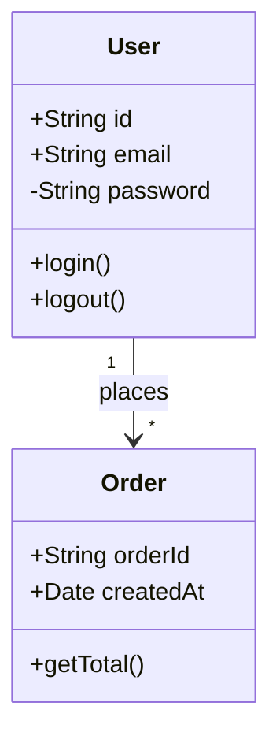

# /mermaid-class

User request: "$ARGUMENTS"

## Task

Generate a Mermaid class diagram for object-oriented design, data models, or UML class structures, or improve an existing diagram.

## Process

1. **Resolve Plugin Path**:

   ```bash
   PLUGIN_DIR="$HOME/.claude/plugins/mermaid"
   ```
2. **Load Reference**: Read `PLUGIN_DIR/references/guides/diagrams/class-diagrams.md` for patterns and syntax
3. **Identify Classes**: Extract class names, attributes (fields), methods (operations), relationships (inheritance, composition, aggregation, association)
4. **Identify Relationships**:
   - Inheritance: `<|--` (extends/implements)
   - Composition: `*--` (strong ownership)
   - Aggregation: `o--` (weak ownership)
   - Association: `--` (simple relationship)
   - Dependency: `..>` (uses)
5. **Generate Diagram**:
   - Use `classDiagram` syntax
   - Keep output theme-first: avoid hardcoded `classDef fill/stroke/color` unless user explicitly requests custom colors
   - Include visibility: `+` public, `-` private, `#` protected, `~` package
   - Add multiplicity for relationships: `1`, `0..1`, `1..*`, `*`
   - Use stereotypes when relevant: `<<interface>>`, `<<abstract>>`, `<<enum>>`
   - Group related classes logically
6. **Validate**:
   - If output is Markdown with ` ```mermaid ` blocks, use:
     `node "$PLUGIN_DIR/scripts/extract_mermaid.js" {file} --validate`
   - Manual check: class syntax, relationship arrows, visibility markers
   - Fix errors using `PLUGIN_DIR/references/guides/troubleshooting.md`
7. **Save**:
   - New diagrams: `class-{description}-{timestamp}.mmd`
   - Edited diagrams: Update existing file

## Optional Config

If `.claude/mermaid.json` exists, apply defaults:

- `theme`
- `auto_validate`
- `output_directory`

## Output

```mermaid
classDiagram
    {complete diagram with relationships}
```

**Saved to:** {filename}
**Validation:** ✅ passed
**Classes:** {count} | **Relationships:** {count}

## Example



<example>
User: "Generate a class diagram for Order, LineItem, and Product"
Assistant: "Outputs classDiagram with attributes, methods, and relationships."
</example>

## Reference

- Patterns: `PLUGIN_DIR/references/guides/diagrams/class-diagrams.md`
- Styling: `PLUGIN_DIR/references/guides/styling-guide.md`
- Common mistakes: `PLUGIN_DIR/references/guides/common-mistakes.md`
- Troubleshooting: `PLUGIN_DIR/references/guides/troubleshooting.md`
