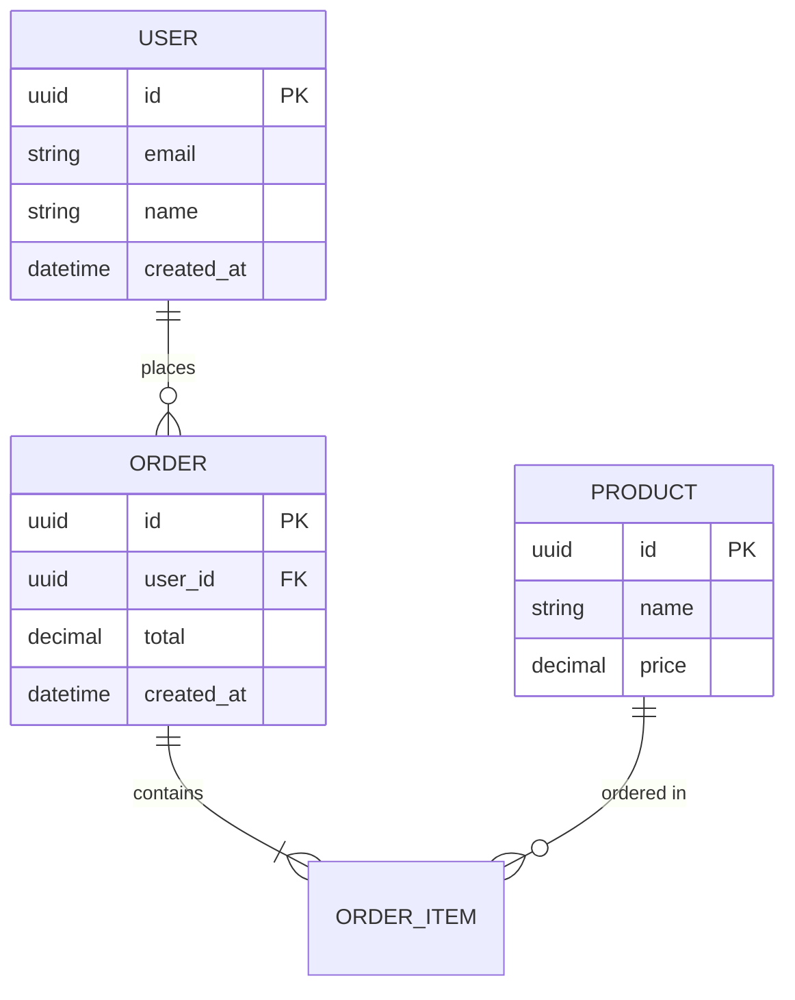

# /mermaid-er

User request: "$ARGUMENTS"

## Task

Generate a Mermaid Entity-Relationship (ER) diagram for database schema design, entity modeling, or data relationships, or improve an existing diagram.

## Process

1. **Resolve Plugin Path**:

   ```bash
   PLUGIN_DIR="$HOME/.claude/plugins/mermaid"
   ```
2. **Load Reference**: Read `PLUGIN_DIR/references/guides/diagrams/er-diagrams.md` for patterns and syntax
3. **Identify Entities**: Extract table/entity names, attributes (columns), primary keys
4. **Identify Relationships**:
   - One-to-One: `||--||`
   - One-to-Many: `||--o{`
   - Many-to-One: `}o--||`
   - Many-to-Many: `}o--o{`
   - Zero or One: `||--o|`
   - Zero or Many: `||--o{`
5. **Generate Diagram**:
   - Use `erDiagram` syntax
   - Keep output theme-first: avoid hardcoded `classDef fill/stroke/color` unless user explicitly requests custom colors
   - Include entity attributes with types
   - Mark primary keys (PK), foreign keys (FK)
   - Add cardinality labels (1, N, 0..1, 1..*)
   - Use descriptive relationship labels
6. **Validate**:
   - If output is Markdown with ` ```mermaid ` blocks, use:
     `node "$PLUGIN_DIR/scripts/extract_mermaid.js" {file} --validate`
   - Manual check: relationship syntax, attribute format, special chars quoted
   - Fix errors using `PLUGIN_DIR/references/guides/troubleshooting.md`
7. **Save**:
   - New diagrams: `er-{description}-{timestamp}.mmd`
   - Edited diagrams: Update existing file

## Optional Config

If `.claude/mermaid.json` exists, apply defaults:

- `theme`
- `auto_validate`
- `output_directory`

## Output

```mermaid
erDiagram
    {complete diagram with entities and relationships}
```

**Saved to:** {filename}
**Validation:** ✅ passed
**Entities:** {count} | **Relationships:** {count}

## Example



<example>
User: "Create an ER diagram for blog posts and comments"
Assistant: "Outputs erDiagram with entities, PK/FK, and cardinalities."
</example>

## Reference

- Patterns: `PLUGIN_DIR/references/guides/diagrams/er-diagrams.md`
- Styling: `PLUGIN_DIR/references/guides/styling-guide.md`
- Common mistakes: `PLUGIN_DIR/references/guides/common-mistakes.md`
- Troubleshooting: `PLUGIN_DIR/references/guides/troubleshooting.md`
