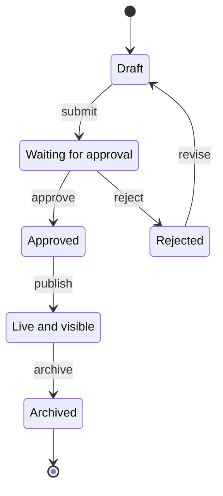

# /mermaid-state

User request: "$ARGUMENTS"

## Task

Generate a Mermaid state diagram for state machines, lifecycle management, or workflow states, or improve an existing diagram.

## Process

1. **Resolve Plugin Path**:

   ```bash
   PLUGIN_DIR="$HOME/.claude/plugins/mermaid"
   ```
2. **Load Reference**: Read `PLUGIN_DIR/references/guides/diagrams/state-diagrams.md` for patterns and syntax
3. **Identify States**: Extract all possible states, initial state, final states
4. **Identify Transitions**: Extract triggers/events that cause state changes, conditions/guards, actions on transitions
5. **Map State Behaviors**:
   - Entry actions (on entering state)
   - Exit actions (on leaving state)
   - Internal transitions (while in state)
6. **Generate Diagram**:
   - Use `stateDiagram-v2` syntax
   - Keep output theme-first: avoid hardcoded `classDef fill/stroke/color` unless user explicitly requests custom colors
   - Mark initial state: `[*] --> StateA`
   - Mark final states: `StateZ --> [*]`
   - Label transitions with triggers/conditions
   - Use composite states for sub-workflows
   - Add notes for important state behaviors
7. **Validate**:
   - If output is Markdown with ` ```mermaid ` blocks, use:
     `node "$PLUGIN_DIR/scripts/extract_mermaid.js" {file} --validate`
   - Manual check: `[*]` syntax, transition arrows, state names quoted if reserved
   - Fix errors using `PLUGIN_DIR/references/guides/troubleshooting.md`
8. **Save**:
   - New diagrams: `state-{description}-{timestamp}.mmd`
   - Edited diagrams: Update existing file

## Optional Config

If `.claude/mermaid.json` exists, apply defaults:

- `theme`
- `auto_validate`
- `output_directory`

## Output

```mermaid
stateDiagram-v2
    {complete diagram with states and transitions}
```

**Saved to:** {filename}
**Validation:** ✅ passed
**States:** {count} | **Transitions:** {count}

## Example



<example>
User: "State diagram for order lifecycle"
Assistant: "Creates stateDiagram-v2 with transitions and terminal state."
</example>

## Reference

- Patterns: `PLUGIN_DIR/references/guides/diagrams/state-diagrams.md`
- Styling: `PLUGIN_DIR/references/guides/styling-guide.md`
- Common mistakes: `PLUGIN_DIR/references/guides/common-mistakes.md`
- Troubleshooting: `PLUGIN_DIR/references/guides/troubleshooting.md`
